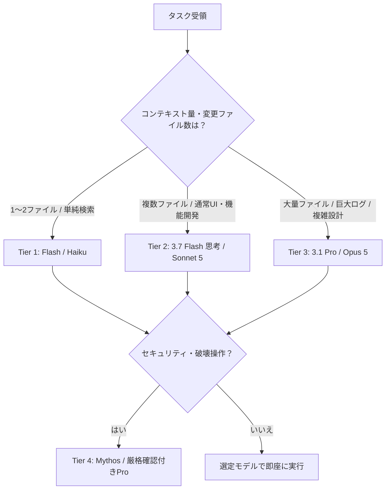

# 🤖 Dynamic Model Router Skill (AIモデル自動判別・最適ルーティング)

このスキルは、ユーザーから与えられたタスクの要件・計算複雑度・トークン消費量を事前に自動解析し、最もコストパフォーマンスと回答精度が高くなるモデルを自動的に選定・適用するためのガイドラインと手順を定義します。

---

## 1. タスク分類と最適モデル選定マトリクス

| タスク層 (Tier) | タスクの具体例 | 特性・必要要件 | 推奨モデル | サブエージェント (invoke_subagent) |
| :--- | :--- | :--- | :--- | :--- |
| **Tier 1: ⚡ 超高速・軽量タスク** | ドキュメント検索、単一ファイルの軽微な修正、型エラー/Lint修正、テストスクリプト実行 | 即応性・高スループット・低トークン消費 | **Gemini 3.7 Flash**<br>**Claude 3.5 Haiku**<br>**GPT-5.6 Luna** | `Model: 'flash_lite'` または `'flash'` |
| **Tier 2: 🛠️ 標準機能開発 & UI実装** | Web画面コンポーネント開発、CSSスタイリング、双方向ブラウザテスト、APIエンドポイント実装 | 高速思考・ツール呼出・バランスの取れた推論 | **Gemini 3.7 Flash (思考モード)**<br>**Claude Sonnet 5**<br>**GPT-5.6 Terra** | `Model: 'inherit'` |
| **Tier 3: 🏰 大規模設計 & 深層推論** | 巨大コードベースの横断解析、多階層アーキテクチャ設計、難関バグの根本原因分析(RCA)、10万行以上のログ解析 | 100万〜200万トークン窓・最高峰の論理推論 | **Gemini 3.1 Pro (1M~2M Context)**<br>**Claude Opus 5**<br>**GPT-5.6 Sol** | `Model: 'pro'` |
| **Tier 4: 🛡️ セキュリティ & 厳格監査** | 脆弱性診断、認証・認可フロー検証、破壊的コマンド実行前の安全評価、コンプライアンスチェック | 高精度防御・厳格な安全性・監査証跡 | **Claude Mythos 5**<br>**GPT-5.6 Daybreak Blue**<br>**Gemini 3.1 Pro** | `Model: 'pro'` + 人間承認フロー |

---

## 2. 自動判別フロー（判別ロジック）

エージェントはタスクを受け取った際、以下のステップで自動判別を行います：



### 判別基準（Decision Rules）:
1. **変更ファイル数が1ファイル以内、または単なる情報検索/構文チェックの場合**:
   - `Tier 1 (Flash / Haiku)` を選択。サブエージェントは `Model: 'flash'` で並列高速実行する。
2. **UIレンダリング、ブラウザ検証、通常の機能追加・テスト作成の場合**:
   - `Tier 2 (Gemini 3.7 Flash 思考モード / Sonnet 5)` を選択。
3. **5ファイル以上の横断リファクタリング、未定義要件からのアーキテクチャ設計、過去ログ全体の分析の場合**:
   - `Tier 3 (Gemini 3.1 Pro / Opus 5)` を選択。サブエージェントは `Model: 'pro'` を指定する。
4. **機密情報・権限設定・破壊的DB操作を含む場合**:
   - `Tier 4 (Mythos / Daybreak / 承認付きPro)` を選択し、実行前に必ず確認を取る。

---

## 3. サブエージェント起動時のコード例

```javascript
// 例1: 単純なファイル検索やリサーチタスク（Flash を指定して高速化＆トークン節約）
invoke_subagent({
  Subagents: [{
    TypeName: "research",
    Role: "Fast Doc Researcher",
    Prompt: "公式ドキュメントから最新のAPI仕様を取得してください",
    Model: "flash"
  }]
});

// 例2: 複雑なアーキテクチャ設計や大規模リファクタリング（Pro を指定して深層推論）
invoke_subagent({
  Subagents: [{
    TypeName: "self",
    Role: "Senior System Architect",
    Prompt: "全モジュールの依存関係を解析し、最適なリファクタリング計画を策定してください",
    Model: "pro"
  }]
});
```

---

## 4. ユーザーへのモデル提案テンプレート

メイン会話でモデルの切り替え（例: Flash ↔ Pro）が望ましいと判断した場合は、以下のように簡潔に理由を添えて提示します：

> 💡 **推奨モデルのご案内**:
> 今回のタスクは [大規模な複数モジュール横断設計 / 100万トークンのログ解析] に該当するため、**Google Gemini 3.1 Pro** または **Claude Opus 5** （深層推論・大容量コンテキスト）への切り替えが最も高精度です。
